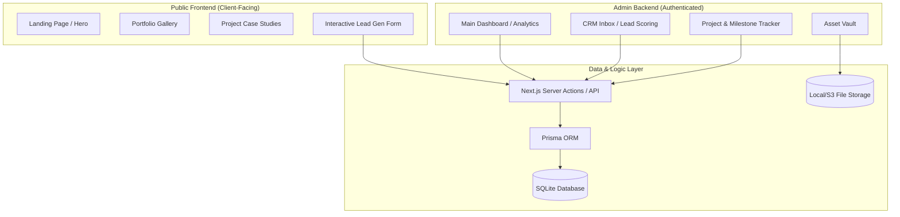

# System Architecture (SA) - Solopreneur One

**Version:** 1.1  
**Status:** [FINAL]  
**Author:** System Architect  

---

## 1. High-Level Architecture

Solopreneur One is a "Single-Tenant" web application designed for deployment on low-overhead infrastructure (VPS, Vercel, or local machine). It leverages Next.js 14 for both frontend and backend logic.

### 1.1 Architecture Diagram (Mermaid)

---

## 2. Component Responsibilities

| Component | Responsibility |
|---|---|
| **Portfolio Frontend** | Deliver a high-performance, SEO-optimized experience for visitors. Focus on LCP and conversion. |
| **Admin Dashboard** | Provide the freelancer with a real-time overview of leads, project statuses, and revenue. |
| **CRM Module** | Handle incoming inquiries, score them, and manage client relationships. |
| **Project Engine** | Track milestones, manage file attachments, and provide status reporting. |
| **Data Layer** | Maintain transactional integrity and provide type-safe access to SQLite. |

---

## 3. Data Flow

1.  **Lead Capture:** Visitor submits interactive form -> Next.js Server Action validates with Zod -> Lead saved to SQLite -> Email notification (optional).
2.  **Conversion:** Admin qualifies lead -> Clicks "Convert" -> Lead data migrated to "Client" and "Project" tables -> Initial milestones generated.
3.  **Project Lifecycle:** Admin updates milestone status -> Database updated -> Progress reflects in Dashboard.

---

## 4. Deployment Architecture

- **Hosting:** Vercel (Frontend + Serverless) or Docker-based VPS (Node.js).
- **Database:** SQLite (persisted via Vercel Blob/S3 mount or local volume).
- **Security:** HTTPS everywhere, Rate-limiting on API routes, Middleware-based auth protection for `/admin`.

---

## 5. Third-Party Dependencies

- **Prisma:** ORM for SQLite.
- **Lucide-React:** Iconography.
- **Framer Motion:** Micro-animations.
- **React Hook Form + Zod:** Form management and validation.
- **Next-Auth / Clerk:** Authentication (Simple session-based for MVP).
