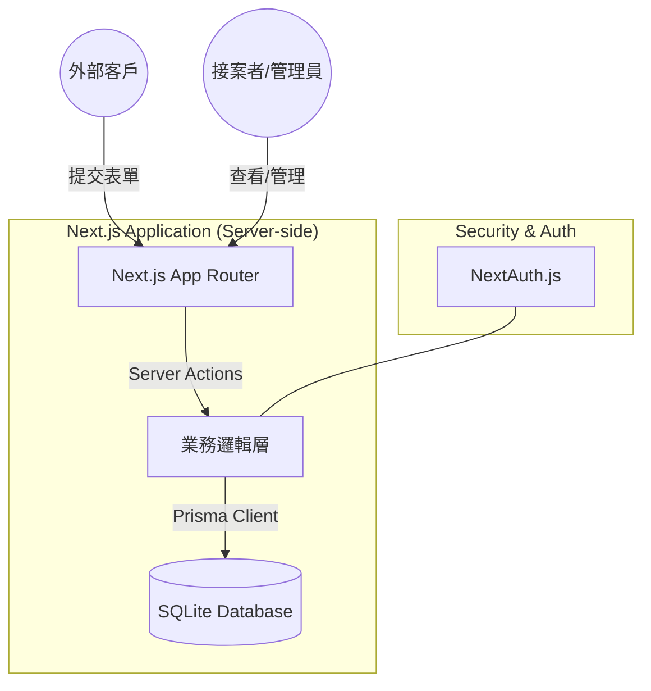

# System Architecture (SA) - 🌐 接案網站 CRM 客戶管理系統

## 1. 高層架構圖 (System Overview)

## 2. 元件職責 (Component Responsibilities)

- **Next.js 14 (App Router)**:
  - **Client Components**: 處理 UI 互動（如：表單輸入、狀態切換按鈕）。
  - **Server Components**: 負責伺服器端渲染、資料抓取 (Fetch) 與權限驗證。
  - **Server Actions**: 作為 API 的替代方案，處理資料寫入與更新。
- **Prisma ORM**: 負責與 SQLite 通訊，提供型別安全 (Type-safe) 的資料庫操作介面。
- **SQLite**: 持久化儲存客戶資訊、詢問單與管理員帳號。
- **NextAuth.js**: 處理管理員登入驗證，保護後台路由 `/admin/*`。

## 3. 資料流 (Data Flow)

1. **詢問流程**: 客戶填寫表單 -> Server Action 驗證資料 -> Prisma 寫入 `Inquiry` 與 `Customer` 表 -> 回傳成功訊息。
2. **管理流程**: 管理員登入 -> Server Component 抓取 `Inquiry` 列表 -> 渲染管理介面 -> 管理員更新狀態 -> Server Action 更新資料庫 -> 觸發 `revalidatePath` 更新 UI。

## 4. 部署架構 (Deployment)

- **環境**: Node.js 18+
- **部署平台**: 可部署於 Vercel (需配合外部 DB 如 PlanetScale/Neon) 或 VPS (直接使用本地 SQLite)。
- **持久化**: 若使用 SQLite，需確保部署環境支援持久化卷 (Persistent Volume)。

## 5. 第三方依賴 (Third-party Dependencies)

- `lucide-react`: 圖示庫。
- `zod`: Schema 驗證（表單驗證與 API 驗證）。
- `shadcn/ui`: UI 元件庫（基於 Radix UI）。
- `date-fns`: 日期格式化。
