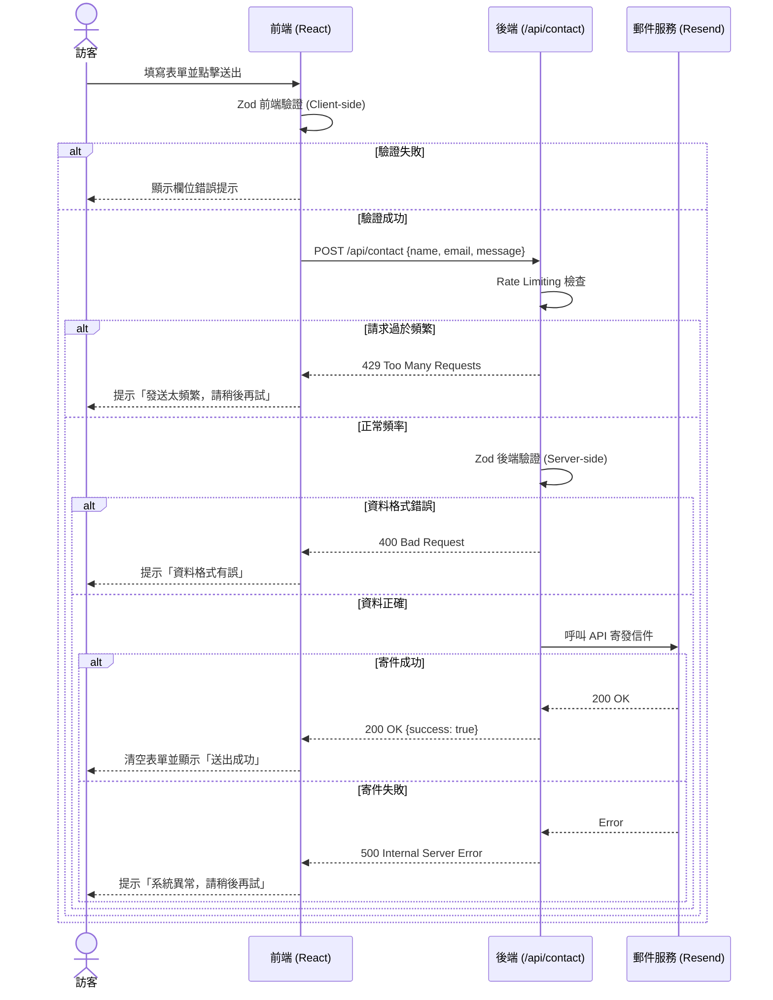

# System Design (SD) - Freelance Portfolio

## 1. API 定義 (API Specifications)

### 1.1 聯絡表單 API
- **Endpoint**: `POST /api/contact`
- **Description**: 接收前端聯絡表單的提交，並觸發寄發電子郵件至網站擁有者信箱。
- **Rate Limit**: 同一 IP 每分鐘最多 3 次請求。

**Request Schema (JSON)**:
```json
{
  "name": "string (required, max 50 chars)",
  "email": "string (required, valid email format)",
  "subject": "string (optional, max 100 chars)",
  "message": "string (required, max 1000 chars)"
}
```

**Response Schema (Success - 200 OK)**:
```json
{
  "success": true,
  "message": "Message sent successfully."
}
```

**Response Schema (Error - 400 Bad Request / 429 Too Many Requests / 500 Internal Server Error)**:
```json
{
  "success": false,
  "error": "Validation failed / Rate limit exceeded / Internal server error details"
}
```

## 2. Data Models / Schema

因本專案 (MVP 階段) 採用無資料庫設計，資料以靜態檔案與 TypeScript Interface 定義：

### 2.1 專案作品 (Project)
```typescript
interface Project {
  id: string;               // 唯一識別碼，例如 'openclaw-fps'
  name: string;             // 專案名稱
  description: string;      // 簡短描述 (繁體中文)
  techStack: string[];      // 技術棧標籤，如 ['TypeScript', 'Three.js']
  githubUrl: string;        // GitHub Repo 連結
  demoUrl?: string;         // Live Demo 連結 (選填)
  imageUrl: string;         // 專案截圖路徑
  features?: string[];      // 主要亮點功能列表
}
```

### 2.2 部落格文章 (BlogPost)
```typescript
interface BlogPost {
  slug: string;             // 文章網址 slug
  title: string;            // 文章標題
  date: string;             // 發布日期 (ISO 格式)
  excerpt: string;          // 列表用的簡短摘要
  content: string;          // Markdown/MDX 原始內容
  tags: string[];           // 分類標籤
}
```

## 3. 錯誤處理策略 (Error Handling Strategy)

- **前端層 (Frontend)**:
  - 欄位驗證錯誤：使用 Zod 配合 React Hook Form 在 Client-side 即時提示錯誤訊息，避免無效請求送出。
  - 網路或伺服器錯誤：捕捉 API 回傳的非 200 狀態碼，透過 UI Toast 元件顯示友善的錯誤提示（如「發送失敗，請稍後再試」）。
- **後端層 (API Routes)**:
  - 統一使用 Try-Catch 包覆非同步邏輯。
  - 對 Request Body 再次進行 Zod 驗證（Server-side Validation），驗證失敗回傳 HTTP 400。
  - 實作 Rate Limiting 中介層，超出限制回傳 HTTP 429。
  - 第三方信件 API 呼叫失敗時，記錄錯誤於 Server Logs（Vercel Logs），並回傳 HTTP 500，但不對外暴露敏感 API Key 錯誤。

## 4. 序列圖 (Sequence Diagram) - 聯絡表單提交流程



## 5. 模組介面定義 (Module Interfaces)

### 5.1 React 元件介面
```typescript
// 聯絡表單元件 Props (目前無需外部傳入 Props，主要管理內部狀態)
interface ContactFormProps {
  className?: string;
}

// 作品集卡片元件 Props
interface ProjectCardProps {
  project: Project;
  index: number; // 用於 Framer Motion 延遲動畫計算
}

// 標籤元件 Props
interface TechBadgeProps {
  label: string;
  variant?: 'primary' | 'secondary' | 'outline';
}
```

### 5.2 服務介面
```typescript
// 電子郵件發送服務抽象介面
interface EmailService {
  sendEmail(payload: {
    to: string;
    from: string;
    subject: string;
    text: string;
    html?: string;
  }): Promise<{ success: boolean; id?: string; error?: string }>;
}
```
