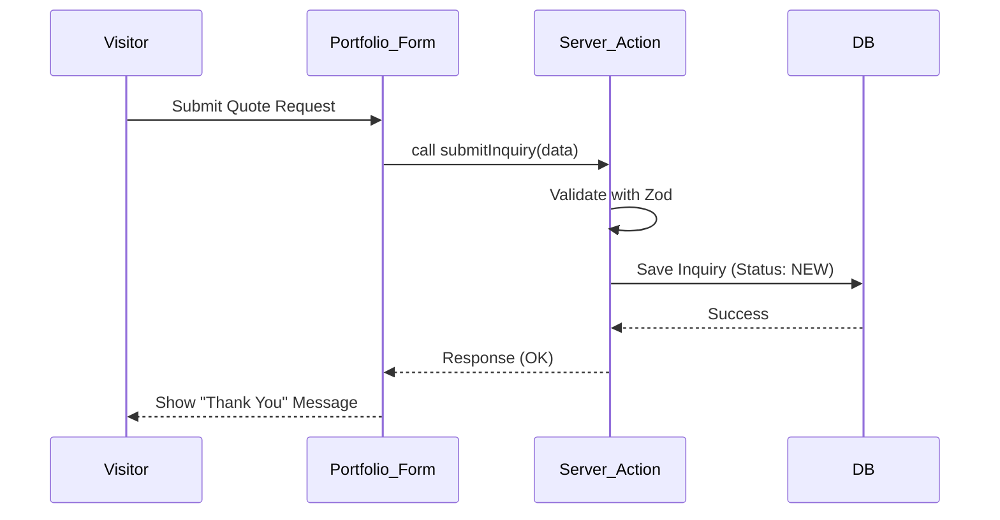

# System Design (SD) - Solopreneur One

**Version:** 1.0  
**Status:** [DRAFT]  
**Author:** System Designer  

---

## 1. Database Schema (Prisma)

The database is built on **SQLite**, focusing on simplicity and performance for single-tenant use.

```prisma
datasource db {
  provider = "sqlite"
  url      = "file:./dev.db"
}

generator client {
  provider = "prisma-client-js"
}

// User (Admin Only)
model User {
  id            String    @id @default(cuid())
  email         String    @unique
  passwordHash  String
  name          String?
  createdAt     DateTime  @default(now())
}

// Inquiry (Lead Generation)
model Inquiry {
  id            String    @id @default(cuid())
  name          String
  email         String
  budget        Float?
  timeline      String?
  message       String
  projectType   String    // e.g., "Web Dev", "Branding"
  score         Int       @default(0) // Automated lead scoring
  status        String    @default("NEW") // NEW, CONTACTED, QUALIFIED, REJECTED, CONVERTED
  createdAt     DateTime  @default(now())
  updatedAt     DateTime  @updatedAt
}

// Client (After Lead Conversion)
model Client {
  id            String    @id @default(cuid())
  name          String
  email         String    @unique
  company       String?
  projects      Project[]
  notes         String?
  createdAt     DateTime  @default(now())
  updatedAt     DateTime  @updatedAt
}

// Project (The Core Work)
model Project {
  id            String    @id @default(cuid())
  title         String
  description   String?
  status        String    @default("DISCOVERY") // DISCOVERY, IN_PROGRESS, REVIEW, COMPLETED, ON_HOLD
  client        Client    @relation(fields: [clientId], references: [id])
  clientId      String
  milestones    Milestone[]
  assets        Asset[]
  startDate     DateTime?
  endDate       DateTime?
  budget        Float?
  createdAt     DateTime  @default(now())
  updatedAt     DateTime  @updatedAt
}

// Milestone (Project Progress)
model Milestone {
  id            String    @id @default(cuid())
  title         String
  description   String?
  status        String    @default("PENDING") // PENDING, COMPLETED
  dueDate       DateTime?
  project       Project   @relation(fields: [projectId], references: [id])
  projectId     String
  order         Int       @default(0)
}

// Asset (Project Files/Links)
model Asset {
  id            String    @id @default(cuid())
  name          String
  url           String
  type          String    // IMAGE, DOCUMENT, LINK
  project       Project   @relation(fields: [projectId], references: [id])
  projectId     String
  createdAt     DateTime  @default(now())
}
```

---

## 2. API Definition (Next.js Server Actions)

Instead of traditional REST endpoints, we prioritize **Server Actions** for better type safety and reduced boilerplate.

| Action Name | Method | Input | Output | Description |
|---|---|---|---|---|
| `submitInquiry` | POST | `InquirySchema` | `{success: boolean, id: string}` | Public lead capture. |
| `getInquiries` | GET | `Filters` | `Inquiry[]` | Admin dashboard view. |
| `qualifyLead` | PATCH | `{id, status}` | `Inquiry` | Update lead status. |
| `convertLead` | POST | `{id}` | `{projectId, clientId}` | Create project/client from inquiry. |
| `updateMilestone` | PATCH | `{id, status}` | `Milestone` | Update milestone progress. |
| `getDashboardStats` | GET | - | `StatsObject` | High-level business analytics. |

---

## 3. Error Handling Strategy

- **Validation Errors:** Zod-based validation on both client and server side.
- **Database Errors:** Prisma exception handling with generic "Internal Server Error" for users, but detailed logging for Admin.
- **Authentication:** Middleware-level protection. Unauthenticated requests to `/admin` redirect to `/login`.

---

## 4. Sequence Diagram (Inquiry to Project)


