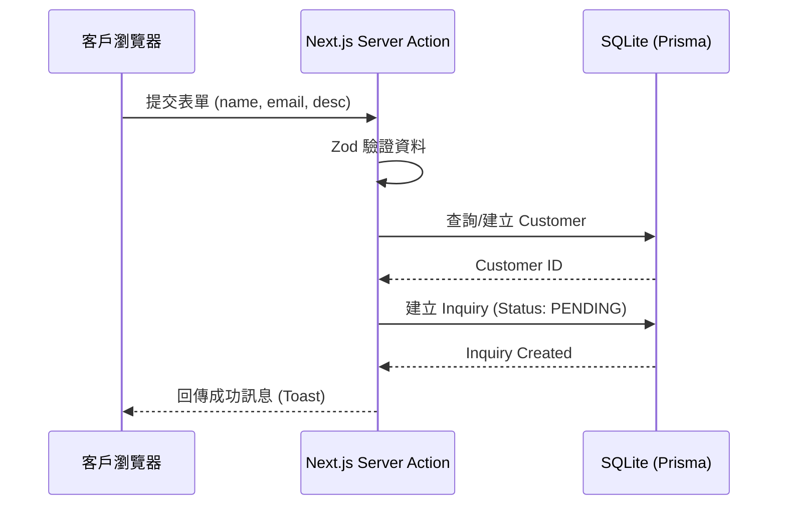

# System Design (SD) - 🌐 接案網站 CRM 客戶管理系統

## 1. 資料庫 Schema (Database Design)

使用 Prisma Schema 定義：

```prisma
// This is your Prisma schema file

datasource db {
  provider = "sqlite"
  url      = "file:./dev.db"
}

generator client {
  provider = "prisma-client-js"
}

model User {
  id            String    @id @default(cuid())
  email         String    @unique
  password      String    // 哈希後的密碼
  name          String?
  createdAt     DateTime  @default(now())
  updatedAt     DateTime  @updatedAt
}

model Customer {
  id            String    @id @default(cuid())
  name          String
  email         String    @unique
  phone         String?
  notes         String?
  inquiries     Inquiry[]
  createdAt     DateTime  @default(now())
  updatedAt     DateTime  @updatedAt
}

model Inquiry {
  id            String    @id @default(cuid())
  description   String    // 需求描述
  budget        String?   // 預算範圍
  status        String    @default("PENDING") // PENDING, CONTACTING, QUOTING, SIGNED, CLOSED, CANCELLED
  customer      Customer  @relation(fields: [customerId], references: [id])
  customerId    String
  createdAt     DateTime  @default(now())
  updatedAt     DateTime  @updatedAt
}
```

## 2. API / Server Actions 定義

### Public Actions
- `submitInquiry(data: InquirySchema)`
  - Input: `name, email, description, budget`
  - Output: `{ success: boolean, id?: string }`
  - Logic: 檢查 Customer 是否存在，若無則建立；建立 Inquiry 記錄。

### Admin Actions (需 Auth 保護)
- `getInquiries(filters: FilterSchema)`
  - Input: `status, keyword, page`
  - Output: `Inquiry[]`
- `updateInquiryStatus(id: string, status: string)`
  - Input: `id, status`
  - Output: `{ success: boolean }`
- `getDashboardStats()`
  - Output: `totalInquiries, pendingInquiries, conversionRate, estimatedRevenue`
- `getCustomerDetails(id: string)`
  - Output: `Customer & { inquiries: Inquiry[] }`

## 3. 錯誤處理策略 (Error Handling)

- **前端驗證**: 使用 `react-hook-form` + `zod` 進行即時欄位檢查。
- **伺服器驗證**: Server Actions 內使用 `zod.safeParse`。
- **異常擷取**: 使用 `try-catch` 包裹資料庫操作，並回傳使用者友好的錯誤訊息（如：`EMAIL_ALREADY_EXISTS`）。
- **全域錯誤介面**: 利用 Next.js `error.tsx` 處理非預期崩潰。

## 4. 關鍵序列圖 (Sequence Diagram)

### 提交詢問單流程


## 5. 模組介面定義 (Module Interfaces)

- **Status 類型**:
  ```typescript
  export type InquiryStatus = 'PENDING' | 'CONTACTING' | 'QUOTING' | 'SIGNED' | 'CLOSED' | 'CANCELLED';
  ```
- **UI 元件規範**:
  - `DataTable`: 具備排序、篩選、分頁功能。
  - `StatusSelect`: 下拉選單用於切換案件狀態。
